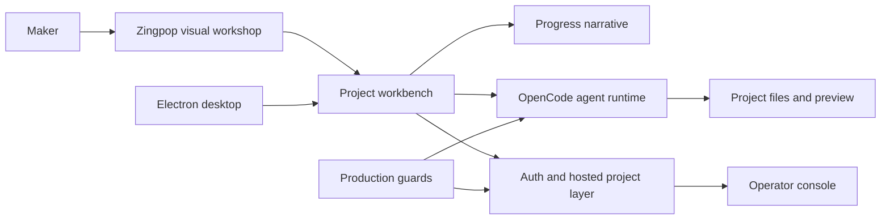

# Zingpop

**An OpenCode-based AI product workbench for people who have an idea, but do not want to begin with a terminal.**

[](https://github.com/lisir202446/zingpop/actions/workflows/verify.yml)
[](LICENSE)

> **Provenance first:** Zingpop started from an [OpenCode](https://github.com/anomalyco/opencode) snapshot and remains an independent downstream adaptation—not an original implementation of the OpenCode core. See [UPSTREAM.md](UPSTREAM.md) for the exact baseline, ownership boundary, and attribution.

## The product decision

Coding agents are already powerful, but a blank prompt, repository terminology, and invisible execution state make them difficult for first-time makers to trust. Zingpop explores a different entry point:

> Start with a product goal, guide the user through design choices, keep project state visible, and turn agent execution into an understandable path toward a shippable artifact.

This is not a cosmetic rebrand. The product work focuses on the layer between a non-technical user's intent and OpenCode's agent runtime.

## What I added after the OpenCode baseline

| Product surface | User problem | Zingpop contribution |
| --- | --- | --- |
| Guided visual workshop | “I do not know how to write the first prompt.” | A prompt-first workshop with curated visual directions and reusable design briefs in [`packages/app/src/pages/prompts`](packages/app/src/pages/prompts). |
| Project workbench | “Where is my project, and can I continue later?” | Hosted project creation, workspace routing, bounded project indexing, and local-folder synchronization. |
| Progress narrative | “The agent looks frozen while it works.” | Phase-based, accessible execution narration and preview-readiness signals in [`session-progress-narrative.tsx`](packages/app/src/pages/session/session-progress-narrative.tsx). |
| China-ready account flows | “The upstream login and billing assumptions do not fit this market.” | Phone/password authentication, SMS readiness work, payment fallbacks, and production environment guards. |
| Operator console | “How do we support users and inspect product state?” | A Zingpop admin backend and management UI in [`packages/console/app/src/routes/admin`](packages/console/app/src/routes/admin). |
| Desktop delivery | “A browser-only experience is not enough for every workflow.” | Electron desktop packaging, startup checks, update metadata, Windows signing gates, and a manual release pipeline. |
| Production readiness | “A demo is not the same as an operable service.” | Nginx/systemd assets, least-privilege backups, health checks, isolation probes, rollback paths, and UX contract checks under [`deploy`](deploy) and [`scripts`](scripts). |

## Product judgment, not feature accumulation

The central bet is that a beginner needs **orientation and confidence before flexibility**. That led to several deliberate choices:

- Begin with visual intent and product examples instead of an empty developer console.
- Show meaningful progress between tool calls instead of exposing raw internal traces.
- Preserve project context across hosted and local workspaces.
- Treat authentication, isolation, backups, and release verification as product requirements.
- Keep the OpenCode engine recognizable and attributable instead of hiding the upstream dependency.

Current non-goals include replacing the OpenCode runtime, claiming compatibility with every upstream release, or presenting upstream community metrics as Zingpop adoption.

## Agent-native way of working

The repository includes the specs, executable checks, and operational probes used to move from product intent to implementation:

1. Define the user-facing contract in a design spec.
2. Convert it into source-level or behavior-level checks.
3. Let coding agents implement bounded changes against those checks.
4. Verify the real product surface, deployment assets, and rollback path.
5. Record ownership and upstream boundaries where reviewers can inspect them.

Examples: [progress-narrative design](docs/superpowers/specs/2026-06-07-zingpop-progress-narrative-design.md), [admin-backend design](docs/superpowers/specs/2026-06-19-zingpop-admin-backend-design.md), and [UX verifier](scripts/verify-zingpop-user-experience.mjs).

## Evidence a reviewer can verify

All figures below are repository facts measured from the recorded import baseline, not audience or revenue claims.

| Evidence | Current repository fact |
| --- | ---: |
| Recorded downstream commits after baseline | 127 |
| Files changed from the baseline | 379 |
| Downstream code/documentation delta | +54,747 / -8,386 lines |
| Visual prompt directions | 26 templates |
| Focused unit checks | 41 app + 5 desktop tests |

Useful review paths:

- [`packages/app/src/pages/prompts.tsx`](packages/app/src/pages/prompts.tsx) — guided visual workshop.
- [`packages/app/src/utils/local-folder-sync.ts`](packages/app/src/utils/local-folder-sync.ts) — local project synchronization boundary.
- [`packages/app/src/pages/session/session-progress-narrative.tsx`](packages/app/src/pages/session/session-progress-narrative.tsx) — user-readable execution progress.
- [`packages/console/app/src/routes/admin`](packages/console/app/src/routes/admin) — operator-facing product controls.
- [`packages/desktop-electron`](packages/desktop-electron) — branded desktop distribution.
- [`deploy`](deploy) — production service, backup, proxy, and health-check assets.

## Architecture



## Run and verify

Prerequisites: Bun 1.3.x, Node.js 22+, and the platform dependencies required by OpenCode.

```bash
bun install --frozen-lockfile --linker hoisted
bun run dev:web
```

The portfolio CI runs focused checks for the Zingpop-owned product surfaces:

```bash
(cd packages/app && bun test --preload ./happydom.ts \
  src/pages/prompts-css.test.ts \
  src/pages/prompts/labels.test.ts \
  src/pages/session/session-progress-narrative-source.test.ts \
  src/utils/local-folder-sync.test.ts \
  src/utils/session-progress-narrative.test.ts \
  src/utils/zingpop-host.test.ts)

(cd packages/desktop-electron && bun test \
  src/main/logging.test.ts \
  src/main/startup.test.ts)

bun scripts/verify-zingpop-user-experience.mjs
bun scripts/verify-zingpop-opencode-config.mjs
bun scripts/verify-zingpop-desktop-release.mjs
```

The public deployment at `zingpop.cn` is currently unavailable, so this README intentionally does not advertise it as a live demo.

## Ownership and limits

I own the Zingpop product direction and the downstream work summarized above. OpenCode's agent runtime, terminal experience, SDKs, and inherited platform code remain the work of the OpenCode maintainers and contributors. The repository keeps the upstream MIT license and records the import boundary in [UPSTREAM.md](UPSTREAM.md).

The product is still an evolving downstream build: the public service is offline, provider credentials are required for a full hosted deployment, and upstream synchronization is manual. A Windows source install also requires the native C++ build toolchain and Windows SDK used by inherited parser dependencies. Those are current constraints, not hidden claims.

## 中文说明

Zingpop 是一个**基于 OpenCode 的下游产品化改造**，目标是让不熟悉终端和代码仓库的用户，也能从产品想法出发，通过可视化引导、项目工作台、过程叙事和预览反馈完成作品。我的工作重点是产品判断、面向新手的交互层、托管项目流程、国内账号场景、运营后台、桌面交付与生产保障；OpenCode 核心运行时归属于其原作者和社区。

面试阅读建议：先看本 README 的产品取舍，再看 [UPSTREAM.md](UPSTREAM.md) 的归属边界，最后检查上方列出的源代码、测试与部署资产。

## License

MIT. OpenCode attribution and downstream provenance are documented in [UPSTREAM.md](UPSTREAM.md).
